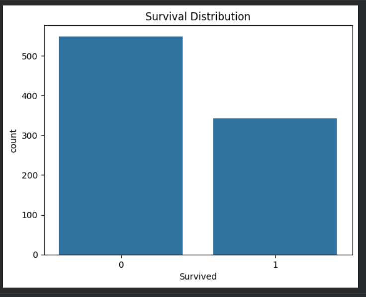
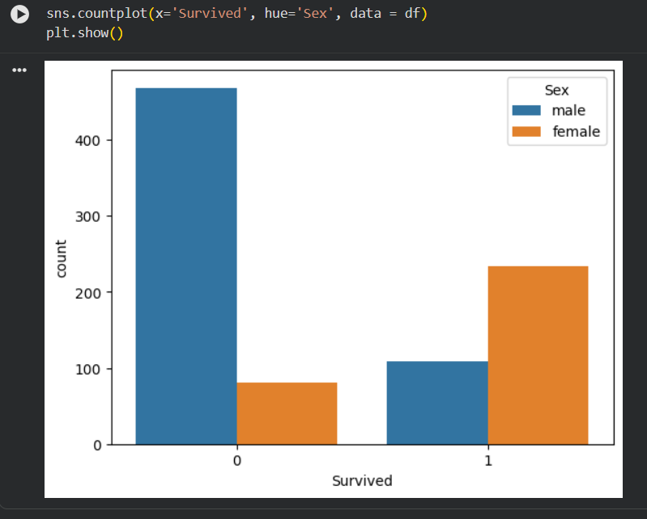
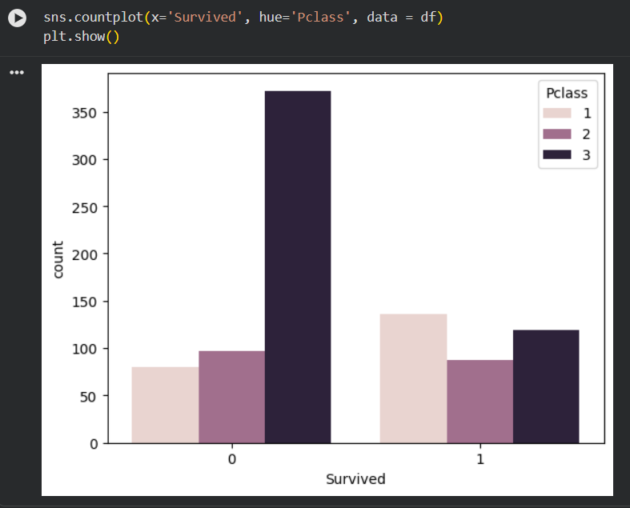

# Titanic-prediction-survival-miniproject
Titanic Survival Prediction is a Machine Learning project developed using Python in Google Colab as part of my internship project. It includes data preprocessing, exploratory data analysis (EDA), data visualization, and predictive modeling to analyze passenger survival patterns in the Titanic dataset using Scikit-learn
# Titanic Survival Prediction

## Overview
This project focuses on predicting passenger survival on the Titanic using Machine Learning. It was developed using Python in Google Colab as part of my internship project. The project includes data preprocessing, exploratory data analysis (EDA), data visualization, and predictive modeling.

## Technologies Used
- Python
- Google Colab
- Pandas
- NumPy
- Matplotlib
- Seaborn
- Scikit-learn

## Project Workflow
1. Data Collection and Understanding
2. Data Cleaning and Preprocessing
3. Exploratory Data Analysis (EDA)
4. Data Visualization
5. Feature Engineering
6. Model Training using Random Forest Classifier
7. Model Evaluation

## Visualizations

### Survival Distribution

### Survival by Gender

### Survival by Passenger Class

## Model Performance
- Algorithm: Random Forest Classifier
- Accuracy: 81%

## Key Insights
- Female passengers had a higher survival rate than male passengers.
- First-class passengers had better survival chances compared to other classes.
- Passenger class and gender were important factors influencing survival.

## Files Included
- DS_Mini_Project.ipynb
- Mini_project.pdf
- mp1.png
- mp2.png
- mp3.png

## Conclusion
This project provided hands-on experience in data preprocessing, visualization, and machine learning model development. It helped strengthen my understanding of Data Science and Machine Learning concepts as part of my internship learning journey.
